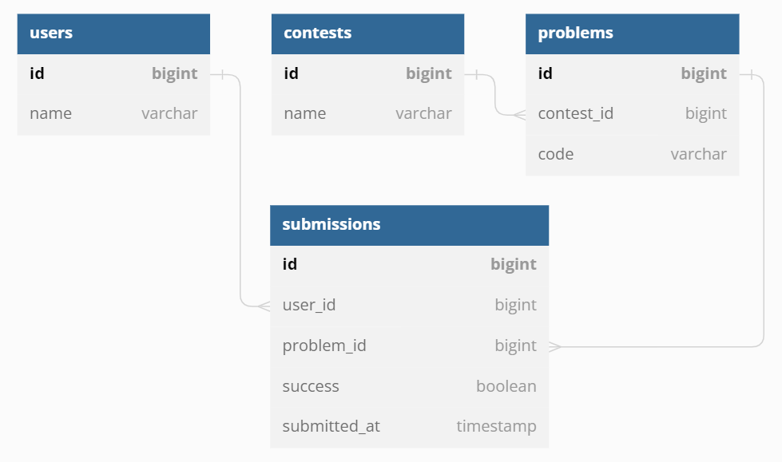

# Статистика пользователей

Это необычная задача — вам надо написать SQL-запрос. В качестве решения вы должны отослать один запрос к базе данных, который возвращает требуемые данные. Запрос может содержать произвольное количество подзапросов, других конструкций, быть сколь угодно навороченным, но это должен быть один запрос (в нём не должна встречаться точка с запятой для разделения разных запросов).

При проверке вашего решения используется PostgreSQL 15.1. В качестве входных данных вам предоставляется дамп состояния базы данных. Обратите внимание, что время работы вашего решения на тесте включает восстановление состояния базы данных из дампа, но это время значительно меньше ограничения по времени. Вы можете использовать сервис http://sqlfiddle.com/ как инструмент для запуска запросов.

В этой задаче вам предстоит написать запрос к базе данных простейшей системы проведения соревнований по программированию. Вы прямо сейчас участвуете в подобном соревновании. Время почувствовать себя в роли разработчика системы для проведения таких соревнований!

Напишите запрос к базе данных, который возвращает всех пользователей вместе с некоторой дополнительной информацией:

* количеством соревнований, в которых он принял участие и решил там хотя бы одну задачу, соответствующую колонку в выводе следует назвать solved_at_least_one_contest_count,
* количеством соревнований, в которых он принял участие (то есть сделал хотя бы одну попытку решения), соответствующую колонку в выводе следует назвать take_part_contest_count.
Строки в выводе сортируйте в первую очередь по невозрастанию solved_at_least_one_contest_count, затем по невозрастанию take_part_contest_count, затем по возрастанию id.

Внимательно ознакомьтесь с примерами вывода. Ваш запрос должен иметь в точности такой же вывод на примерах.

Схема базы данных содержит четыре таблицы:

* users — пользователи системы (описываются двумя полями: id и name),
* contests — контесты в системе (описываются двумя полями: id и name),
* problems — задачи в системе, каждая задача принадлежит одному контесту (описываются тремя полями: id, contest_id и code, где code — это кодовое короткое название задачи),
* submissions — отосланные попытки решения задач, каждая попытка принадлежит одной задаче и одному пользователю (описываются 5 полями: id, user_id, problem_id, success и submitted_at, где success — это булевское значение была ли попытка успешной и submitted_at — дата-время, когда попытка была совершена).
Таким образом, contests и problems находятся в отношении «один ко многим», submissions и users находятся в отношении «многие к одному», submissions и problems находятся в отношении «многие к одному».

Изучите входные данные примера, чтобы подробно ознакомиться со схемой базы данных. Диаграмма ниже иллюстрирует схему базы данных.



#### Входные данные
Входными данными в этой задаче является дамп базы данных. Вам он может быть полезен для ознакомления с состоянием базы данных для конкретного теста. В качестве решения вы должны отправить один SQL-запрос.

#### Выходные данные
Ваш SQL-запрос должен вывести всех пользователей вместе с дополнительными колонками, как написано выше. В точности следуйте требованиям к именованию дополнительных колонок и порядку сортировки.

Внимательно ознакомьтесь с примерами вывода. Ваш запрос должен иметь в точности такой же вывод на примерах.

### Пример
#### Входные данные:
```sql
create table users (
                       id bigint primary key,
                       name varchar not null
);

create table contests (
                          id bigint primary key,
                          name varchar not null
);

create table problems (
                          id bigint primary key,
                          contest_id bigint,
                          code varchar not null,
                          constraint fk_problems_contest_id foreign key (contest_id) references contests (id)
);

create unique index on problems (contest_id, code);

create table submissions (
                             id bigint primary key,
                             user_id bigint,
                             problem_id bigint,
                             success boolean not null,
                             submitted_at timestamp not null,
                             constraint fk_submissions_user_id foreign key (user_id) references users (id),
                             constraint fk_submissions_problem_id foreign key (problem_id) references problems (id)
);

insert into users
values (1, 'Marie Curie'),
       (2, 'Stephen Hawking'),
       (3, 'Ada Lovelace'),
       (4, 'Albert Einstein'),
       (5, 'Archimedes');

insert into contests
values (1, 'Sandbox-Juniors'),
       (2, 'Sandbox-Seniors'),
       (3, 'Contest-Juniors'),
       (4, 'Contest-Seniors');

insert into problems
values (1, 1, 'A'),
       (2, 2, 'A'),
       (3, 3, 'A'),
       (4, 3, 'B'),
       (5, 4, 'A'),
       (6, 4, 'B');

insert into submissions
values (1, 2, 2, false, '2023-02-05 11:01:00'),
       (2, 2, 2, true, '2023-02-05 11:02:00'),
       (3, 2, 6, true, '2023-02-05 11:03:01'),
       (4, 2, 1, true, '2023-02-05 11:04:00'),
       (5, 2, 1, true, '2023-02-05 11:05:00'),
       (6, 3, 6, true, '2023-02-05 11:06:00'),
       (17, 1, 6, true, '2023-02-05 11:03:00'),
       (8, 1, 2, true, '2023-02-05 11:08:00'),
       (9, 1, 1, false, '2023-02-05 11:09:00'),
       (10, 3, 1, false, '2023-02-05 11:10:00'),
       (11, 5, 5, false, '2023-02-05 11:11:00'),
       (13, 2, 6, true, '2023-02-05 11:03:00'),
       (14, 3, 6, false, '2023-02-05 11:05:59'),
       (15, 1, 6, true, '2023-02-05 11:04:00');
```

#### Выходные данные:
```sql
 id |      name       | solved_at_least_one_contest_count | take_part_contest_count
----+-----------------+-----------------------------------+-------------------------
  2 | Stephen Hawking |                                 3 |                       3
  1 | Marie Curie     |                                 2 |                       3
  3 | Ada Lovelace    |                                 1 |                       2
  5 | Archimedes      |                                 0 |                       1
  4 | Albert Einstein |                                 0 |                       0
(5 rows)
```