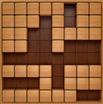
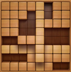
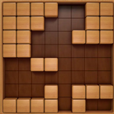
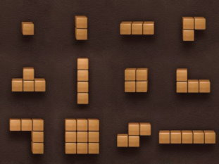

# Block Jigsaw Puzzle
Слышали о Block Jigsaw Puzzle? Сейчас расскажем!

Игра происходит на поле 8×8. Каждая клетка поля либо свободна, либо занята блоком. Например, ниже на картинке изображено одно из возможных текущих состояний поля.



Вам поступают фигуры, которые вы должны укладывать на поле. Вращать фигуры вы не можете. Когда вы кладёте фигуру на поле, все клетки, соответствующие этой фигуре, должны быть свободны. Вы можете выбрать любой из корректных способов положить фигуру.

Например, допустим, вы хотите положить следующую фигуру на поле:


Есть всего один корректный способ положить её:



Как только фигура оказалась на поле, все полностью заполненные блоками строки и столбцы поля очищаются. Это действие происходит мгновенно, оставшиеся заполненные блоки остаются неподвижными.

В рассматриваемом примере очистятся одна строка и один столбец. После этого поле примет следующий вид:



Возможные фигуры для укладывания могут выглядеть следующим образом:



Могут быть даны любые повороты и зеркальные отражения фигур с картинки выше. В процессе укладывания фигуры вращать её нельзя.

Вам задано текущее состояние поля и набор фигур для укладывания. Ваша цель — уложить фигуры так, чтобы минимизировать количество блоков на поле в конце игры. Фигуры можно укладывать в любом порядке. Обратите внимание, что каждый раз после размещения очередной фигуры на поле происходит очищение полностью заполненных блоками строк и столбцов.

Требуется последовательно уложить все фигуры и вывести минимальное количество блоков, которое останется на поле после укладывания всех фигур. Выведите -1, если уложить все фигуры невозможно.

Неполные решения этой задачи (например, недостаточно эффективные) могут быть оценены частичным баллом. Для набора 15 баллов достаточно решить частный случай задачи с k=1.

#### Входные данные
Первые 8 строк содержат по 8 символов каждая — текущее состояние поля. Символ '.' (точка) соответствует пустой клетке, а символ '*' (звёздочка) — клетке с блоком. Гарантируется, что текущее состояние поля таково, что в нём нет сплошных строк и/или столбцов из блоков.

Следующая строка содержит целое число k (1≤k≤3) — количество заданных фигур. Обратите внимание, что первые тесты содержат только k=1, и для набора 15 баллов достаточно решить частный случай задачи с k=1.

Затем заданы фигуры. Описание каждой фигуры начинается со строки, которая содержит целое число li (1≤li≤5) — количество строк в описании фигуры. Затем заданы li строк с описанием фигуры в виде прямоугольника минимального размера, который её содержит. Формат задания аналогичен тому, как задано поле. Каждая фигура является одной из 12 допустимых (перечислены на картинке выше), возможно, повёрнутая и/или отражённая.

#### Выходные данные
Выведите одно целое число — минимальное количество блоков на поле после укладывания k заданных фигур в произвольном порядке оптимальным способом.

Выведите -1, если не существует способа уложить все фигуры на поле.

Заметим, что последний пример иллюстрирует случай k>1. Этот пример не обязательно должен проходить, чтобы вы набрали 15 баллов.
#### Пример
#### Входные данные
```azure
*****.**
***.*.**
**..****
**..*...
........
****.***
...*.***
******..
1
3
***
..*
..*
```
#### Выходные данные
```azure
29
```

#### Входные данные
```azure
.*******
******.*
*****.**
*.....**
*****.**
*.***.**
**.*****
*******.
1
3
.*
**
.*
```
#### Выходные данные
```azure
33
```
#### Входные данные
```azure
*.******
..******
*..**.**
*.*.****
*.***.**
*.**..**
*.*.**.*
*.*****.
1
2
**.
.**
```
#### Выходные данные
```azure
28
```

#### Входные данные
```azure
***.****
*.******
.***....
*.*....*
*.***..*
*.....*.
*...*.**
.******.
3
2
**
**
5
*
*
*
*
*
2
.**
**.
```
#### Выходные данные
```azure
18
```
